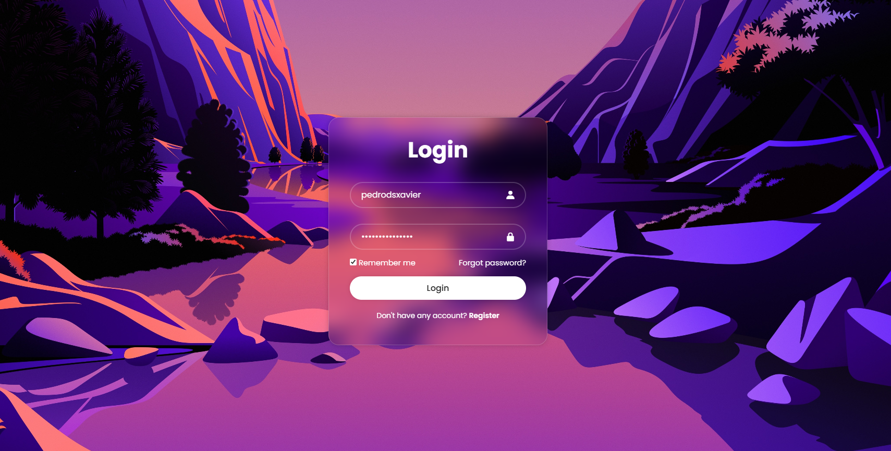

# Secure-UI

A simple web project demonstrating basic HTML and CSS concepts.

## Overview

- **HTML structure**: A single `index.html` file with a clean and semantic layout.
- **CSS styling**: Styles are separated into a `css/` folder, applied to enhance the visual appearance.

## Features Used

1. **HTML Basics**
   - Semantic tags like `<header>`, `<main>`, `<footer>`
   - Proper nesting of elements

2. **CSS Styling**
   - External CSS linked from `css/style.css`
   - Background image positioning (`background-position: center;`)
   - Covering the element area (`background-size: cover`)
   - Opacity management using `opacity` and `rgba()`

3. **Images**
   - Background image for design
   - Screenshots for documentation